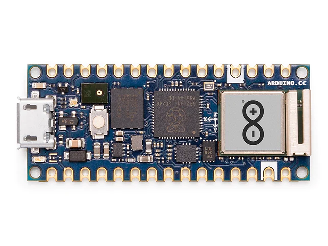

.. _arduino_nano_rp2040_connect:

Arduino Nano RP2040 Connect
###########################

Overview
********

The Arduino Nano RP2040 Connect is a small form factor development board with USB,
Wifi, Bluetooth, a 6 axis IMU, PDM microphone and a secure element.

Hardware
********
- Dual core Arm Cortex-M0+ processor running up to 133MHz
- 264KB on-chip SRAM
- 16MB on-board QSPI flash with XIP capabilities
- 18 GPIO pins
- 4 Analog inputs
- 1 UART peripherals
- 1 SPI controllers
- 2 I2C controllers
- 16 PWM channels
- USB 1.1 controller (host/device)
- 8 Programmable I/O (PIO) for custom peripherals
- Wifi and Bluetooth via u-blox NINA-W102
- On-board RGB LED (Connected to NINA-W102)
- On-board user LED (Connected SPI0_CS)
- 1 Watchdog timer peripheral

The arduino_nano_rp2040_connect board configuration supports the following
hardware features:

.. list-table::
   :header-rows: 1

   * - Peripheral
     - Kconfig option
     - Devicetree compatible
   * - NVIC
     - N/A
     - :dtcompatible:`arm,v6m-nvic`
   * - UART
     - :kconfig:option:`CONFIG_SERIAL`
     - :dtcompatible:`raspberrypi,pico-uart`
   * - GPIO
     - :kconfig:option:`CONFIG_GPIO`
     - :dtcompatible:`raspberrypi,pico-gpio`
   * - ADC
     - :kconfig:option:`CONFIG_ADC`
     - :dtcompatible:`raspberrypi,pico-adc`
   * - I2C
     - :kconfig:option:`CONFIG_I2C`
     - :dtcompatible:`snps,designware-i2c`
   * - SPI
     - :kconfig:option:`CONFIG_SPI`
     - :dtcompatible:`raspberrypi,pico-spi`
   * - USB Device
     - :kconfig:option:`CONFIG_USB_DEVICE_STACK`
     - :dtcompatible:`raspberrypi,pico-usbd`
   * - HWINFO
     - :kconfig:option:`CONFIG_HWINFO`
     - N/A
   * - Watchdog Timer (WDT)
     - :kconfig:option:`CONFIG_WATCHDOG`
     - :dtcompatible:`raspberrypi,pico-watchdog`
   * - PWM
     - :kconfig:option:`CONFIG_PWM`
     - :dtcompatible:`raspberrypi,pico-pwm`
   * - Flash
     - :kconfig:option:`CONFIG_FLASH`
     - :dtcompatible:`raspberrypi,pico-flash`

Porgramming and Debugging
*************************

Flashing
========

Using UF2
---------

Since the board doesn't expose the SWD pins on the headers, the easiest method
of flashing the board is using UF2. By default building an app for this board
will generate a `build/zephyr/zephyr.uf2` file. If the board is powered on
while the `REC` pin is connected to ground, the board will enter the UF2
bootloader. Now the board will appear as a mass storage device. The UF2 file
can now be drag-and-dropped to the device, which will flash the Nano RP2040
Connect.

Alternatively the board can be flashed by using the uf2 runner.

.. zephyr-app-commands::
   :zephyr-app: samples/basic/blinky
   :board: arduino_nano_rp2040_connect
   :goals: build

.. code-block:: bash

   west flash --runner uf2

Using SWD
=========

The board expose the SWD signals on testpads at the bottom of the board. For
the location of the testpads see the board `schematic`_. After soldering wires
to these testpads the board can be flashed using the supported SWD tools.

.. target-notes::

.. _schematic:
   https://content.arduino.cc/assets/ABX00053-schematics.pdf